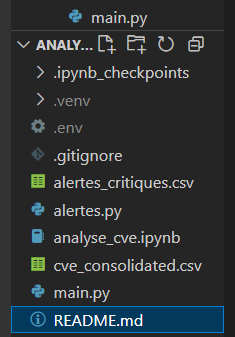

# Analyse des Bulletins de Sécurité ANSSI – Projet Mastercamp 2025

Ce projet a pour but d’automatiser la récupération et l’analyse des bulletins de sécurité publiés par l’ANSSI (avis et alertes). Il permet d’en extraire les vulnérabilités (CVE), de les enrichir avec des données issues d’APIs publiques, et de produire une analyse visuelle.

## Étapes réalisées

1. **Extraction des bulletins** depuis les flux RSS de l’ANSSI
2. **Extraction des identifiants CVE** à partir des bulletins JSON
3. **Enrichissement des CVE** via :
   - l’API MITRE (description, score CVSS, type CWE, produits concernés…)
   - l’API EPSS (score d’exploitabilité)
4. **Consolidation des données** dans un fichier CSV unique (`cve_consolidated.csv`)
5. **Analyse exploratoire** avec génération automatique de plusieurs graphiques (notebook Jupyter)
6. **Détection automatique d’alertes critiques** et **notification e-mail**


## Fichiers à exécuter
Voici l’ordre d’exécution recommandé :

```bash
python main.py
# ➜ Extrait les bulletins, les CVE, les enrichit et génère le fichier final 'cve_consolidated.csv'

jupyter notebook analyse_cve.ipynb
# ➜ Ouvre le notebook pour produire les visualisations (graphiques, camemberts, corrélations)

python alertes.py
# ➜ Identifie les CVE critiques (CVSS ≥ 9, severity CRITICAL) pour certains éditeurs
# ➜ Envoie automatiquement une notification e-mail si configuré
# ➜ Génère un fichier 'alertes_critiques.csv'
```

## 🔐 Configuration de l'environnement (.env)

Avant d'exécuter le script, créez un fichier `.env` à la racine du projet pour y stocker vos identifiants de manière sécurisée.

### Exemple de contenu `.env`

```env
EMAIL_SENDER=ton_email@gmail.com
EMAIL_PASSWORD=ton_mot_de_passe_application(demander a chat comment faire avec gmail)
EMAIL_DESTINATAIRE=destinataire@example.com(tu peux remettre le tien ça fontionne)
